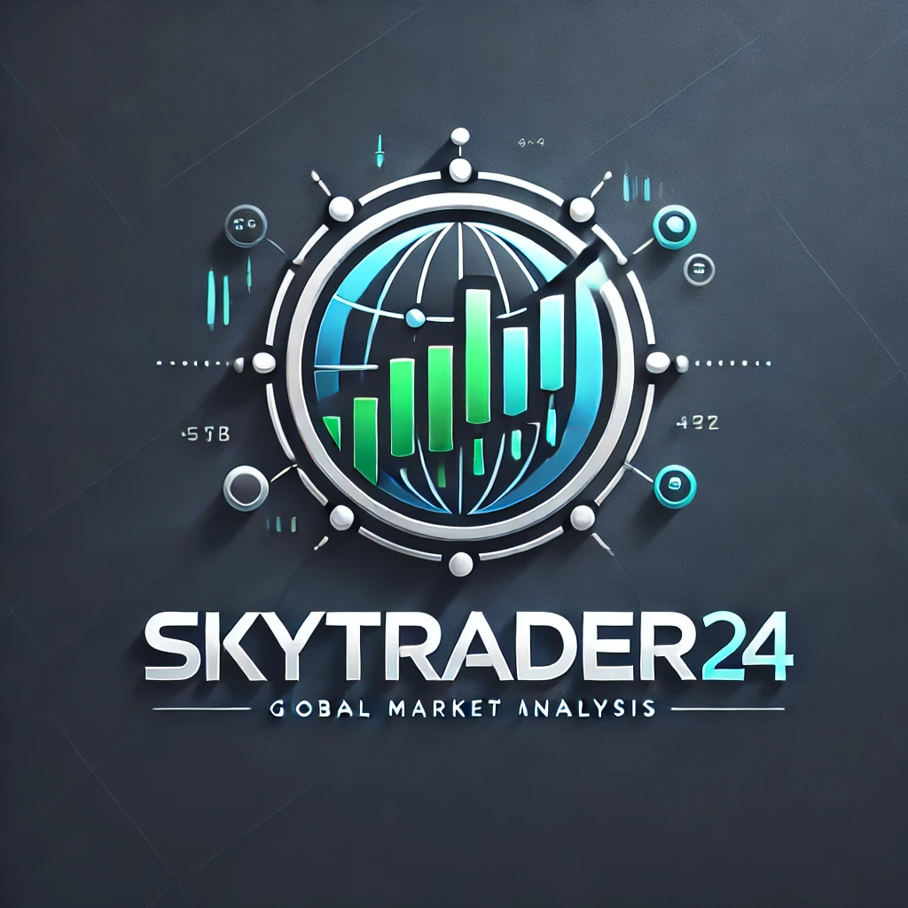

  

## 🎯 Project Goal

The goal of the application is to simplify the process of gathering information on the capital market, world events, and analyzing their impact on stock markets, with minimal user effort.  
SkyTrader24 aggregates and analyzes content from platforms like YouTube and news portals to generate automatic summaries and market forecasts.

## 🌐 SkyTrader24 as SaaS

SkyTrader24 will be provided as a **Software as a Service (SaaS)** platform. This means:

- **No Installation Required:**  
  Users can access the application via a web browser without needing to set up the software locally.

- **Subscription-Based Access:**
   - Basic functionality will be available for free.
   - Premium features (e.g., advanced analysis, custom notifications, and detailed reports) will require a subscription.

- **Automatic Updates:**  
  SaaS ensures the latest features and improvements are available instantly to all users without any manual updates.

## 📑 Table of Contents

1. [Project Goal](#-project-goal)
2. [Roadmap](#-roadmap)
3. [Technologies Used](#-technologies-used)
    - [Frontend](#frontend)
    - [Backend](#backend)
    - [Database](#database)
    - [DevOps](#devops)
4. [Architecture](#-architecture)
5. [Installation and Setup](#-installation-and-setup)
6. [License](#-license)

---

## 🎯 Project Goal

The goal of the application is to simplify the process of gathering information on the capital market, world events, and analyzing their impact on stock markets, with minimal user effort.  
SkyTrader24 aggregates and analyzes content from platforms like YouTube and news portals to generate automatic summaries and market forecasts.

---

## 📅 Roadmap

The full roadmap with detailed features and plans is available [here](./ROADMAP.md).

---

## 🛠️ Technologies Used

### Frontend
- **Angular 18.2**: Framework for building web applications
- **TailwindCSS**: For user interface styling
- **vis.js**: For visualizing network correlations
- **chart.js, d3.js**: For visualizing market data

### Backend
- **Java 21 (GraalVM)**: Runtime environment
- **Spring Boot 3.2.2**: REST API architecture
- **Maven**: Project dependency management

### Database
- **PostgreSQL**: Storing user data, authentication, transactional data
- **MongoDB**: Storing dynamic data, transcripts, analyses

### DevOps
- **Docker**: Containerization
- **GitHub Actions**: CI/CD
- **Kubernetes**: Cloud scaling
- **Terraform/Tofu**: Infrastructure as code management
- **AWS**: Cloud services

### API Integrations
- **YouTube Data API**: Retrieving video data
- **Yahoo Finance API**: Market data integration
- **SMS Gateway**: Sending SMS messages
- **SMTP Email Integration**: Sending emails
- **Whisper**: Processing video transcripts

---

## 🏗️ Architecture

SkyTrader24 is built as a modular monolith with a Spring Boot backend handling REST API requests from an Angular front end. Migration to microservices is planned for future scalability.

## 📜 License

This project is proprietary. See the [LICENSE.md](./LICENSE.md) file for details.
